# Section 1: Selling CI/CD to your Team/Organization

CRITERIA
MEETS SPECIFICATIONS
Explain the fundamentals and benefits of CI/CD to achieve, build, and deploy automation for cloud-based software products.

``` 
1. CI/CD increases the productivity of Dev and Ops personnel by reducing manual development work. Instead, it enables them to concentrate more on improving the way they produce software.
Continuous Delivery (CD) automatically sends code changes to environments that are ready for production for approval, while Continuous Deployment (CD) automatically releases code changes to customers. 
2. Continuous Integration (CI) automatically builds, tests, and integrates code changes within a shared repository.
3. An automated CI/CD pipeline has many advantages, including ensuring you're building the proper product for your users and speeding up issue fixes, as well as streamlining your entire software development process.
```

The CI/CD benefits proposal contains essential benefits of CI/CD, and describes the business context that will benefit from the automation tools. Explanation should include benefits that translate to revenue and cost for the business.
```
1. Benefits that translate to revenue and expense for the business should be included in the CI/CD benefits proposal1. Scalability, elasticity, and better performance, attributes of cloud-native applications, are made possible by CI/CD. When done correctly, it enables teams to methodically test each change made to the source code and standardizes deployment methods across all projects.
2. With the help of automation, CI/CD is a two-step method that significantly accelerates the creation and delivery of software. Continuous Integration (CI) improves developer chores like source code integration and version control so that software may be released into production more quickly. Software testing and deployment are automated via continuous delivery (CD).
```

# Section 2: Deploying Working, Trustworthy Software

CRITERIA
MEETS SPECIFICATIONS
## Utilize Deployment Strategies to design and build CI/CD pipelines that support Continuous Delivery processes.

A public git repository with your project code. [https://github.com/ducluanxutrieu/cdond-c3-projectstarter]

Evidence of code-based CI/CD configuration in the form of yaml files in your git repository.

Console output of various pre-deploy job failure scenarios:

Build Jobs that failed because of compile errors. 


Failed unit tests. 
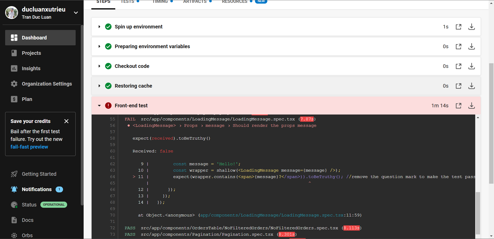
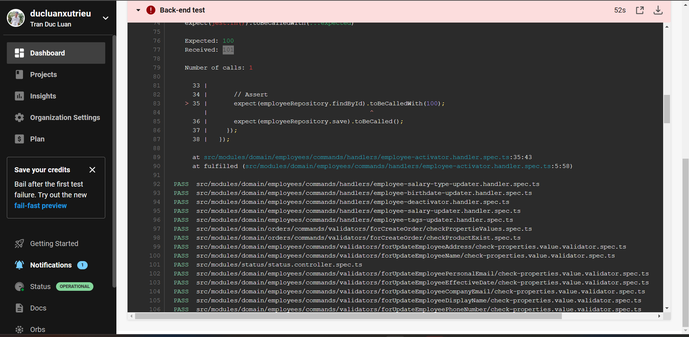

Failure because of vulnerable packages.
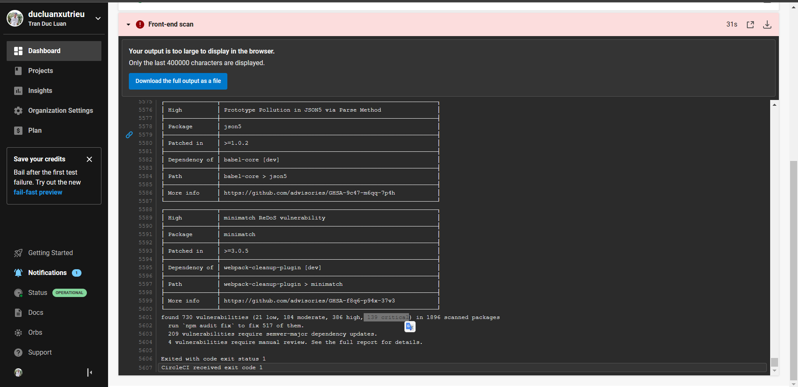
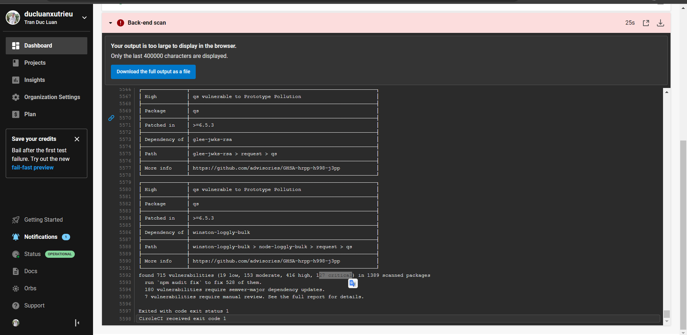

An alert from one of your failed builds. [SCREENSHOT04]
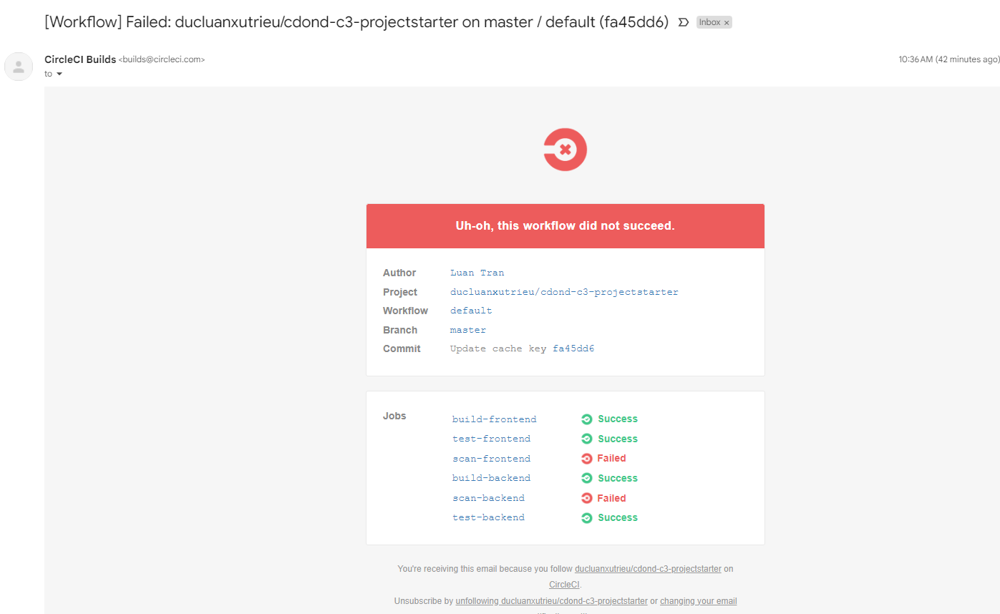
Evidence in your code that:

Compile errors have been fixed.
Unit tests have been fixed.
All critical security vulnerabilities caught by the “Analyze” job have been fixed.
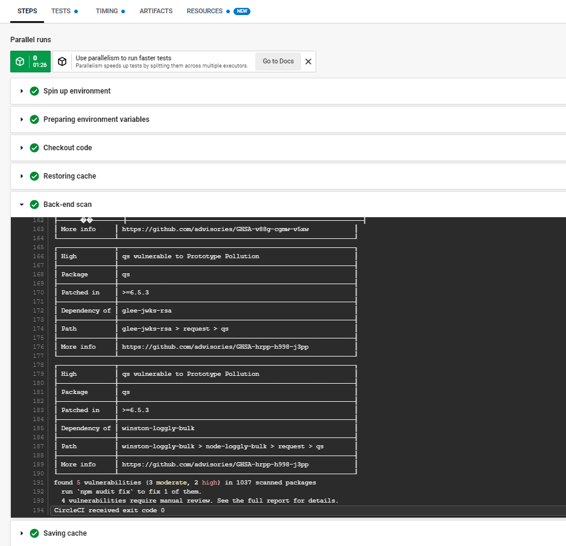
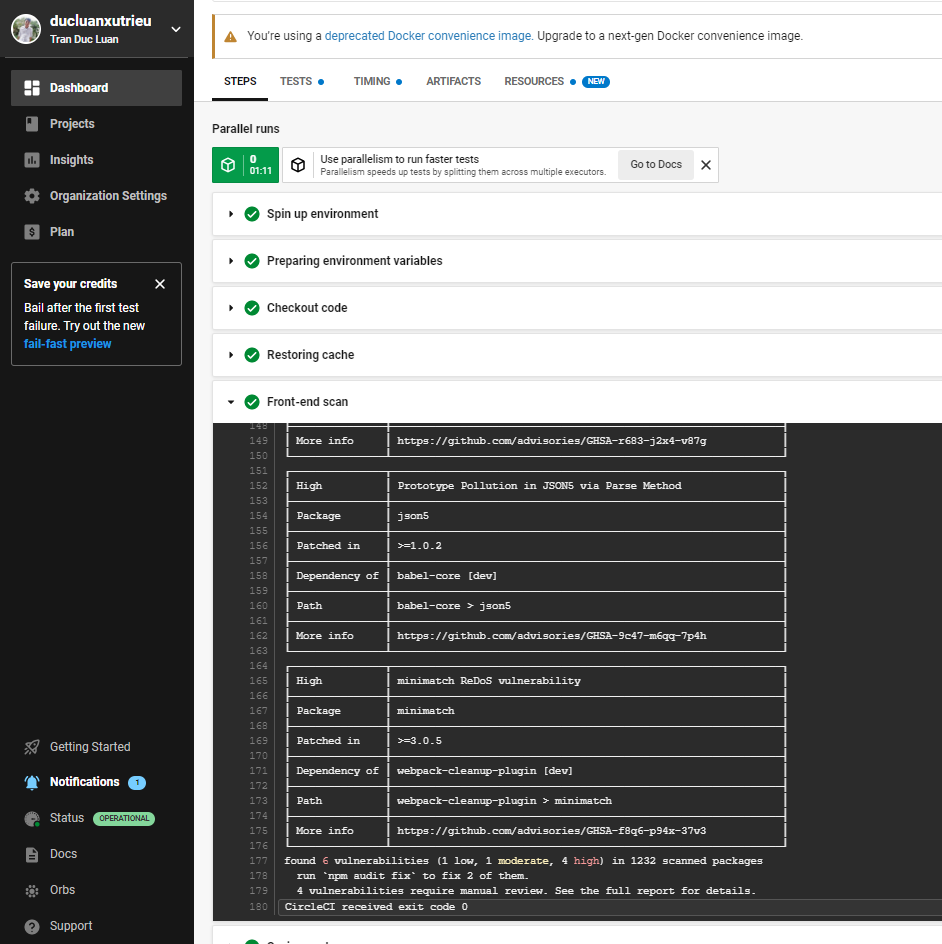
Utilize a configuration management tool to accomplish deployment to cloud-based servers.

Console output of appropriate failure for infrastructure creation job (using CloudFormation). [SCREENSHOT05]
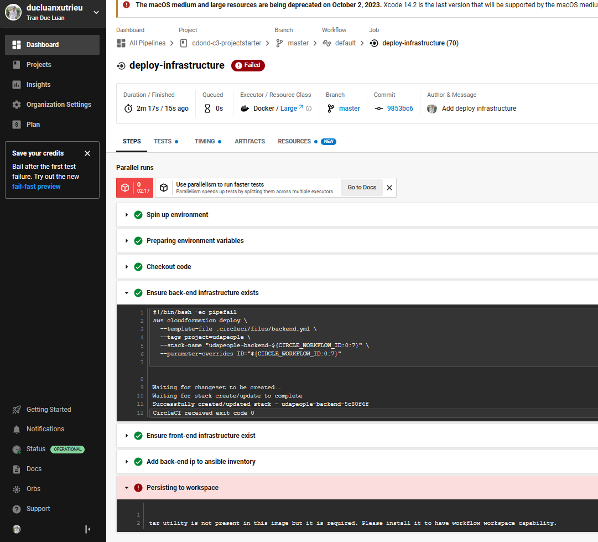

Console output of a smoke test job that is failing appropriately. [SCREENSHOT06]
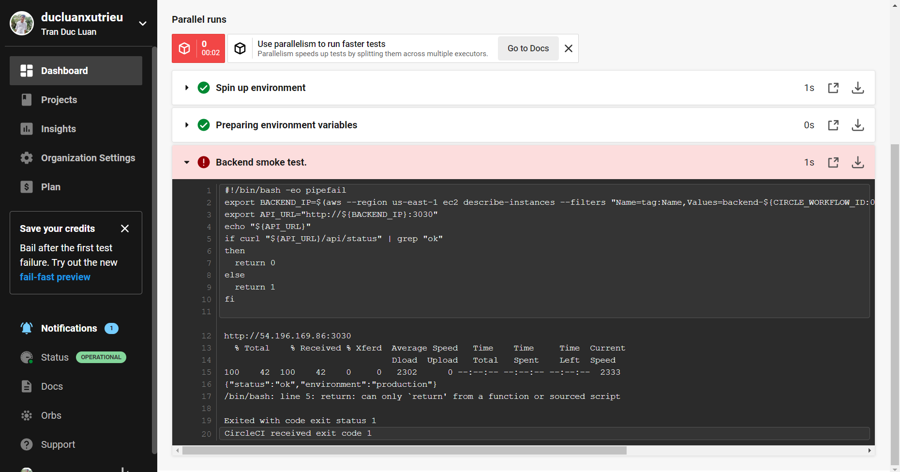

Console output of a successful rollback after a failed smoke test. [SCREENSHOT07]
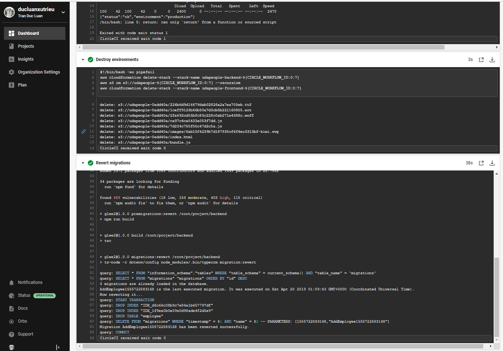

Console output of successful promotion of new version to production in CloudFront. [SCREENSHOT08]
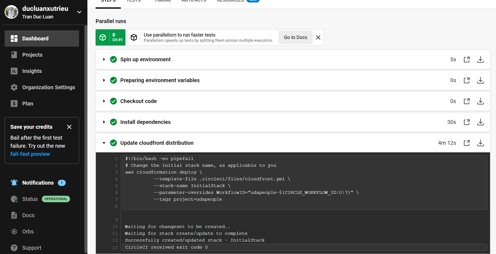
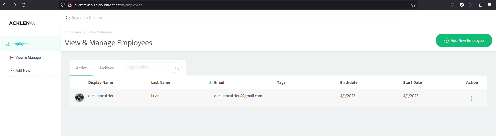

Console output of successful cleanup job that removes old S3 bucket and EC2 instance. [SCREENSHOT09]
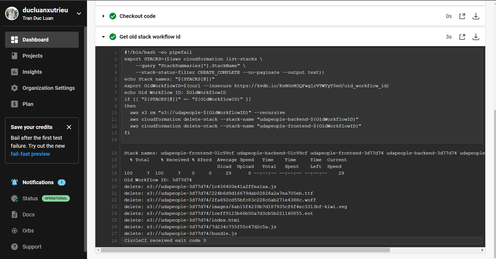

Evidence that deploy jobs only happen on master branch. [SCREENSHOT10]
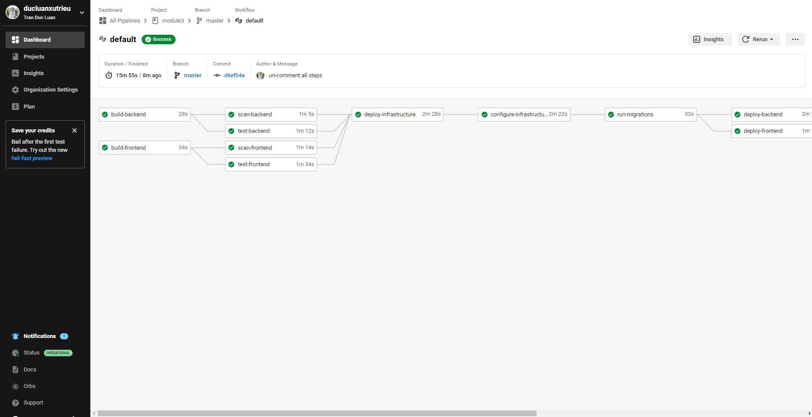
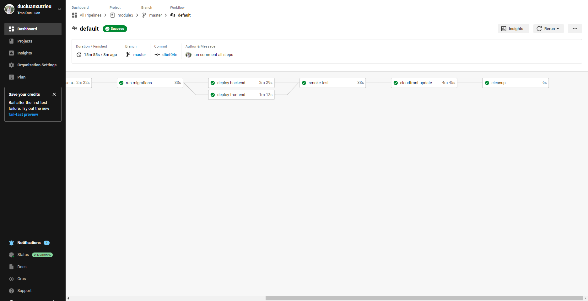

Evidence of deployed and functioning front-end application in an S3 bucket [URL02] and in CloudFront. [URL03]

[S3 URL] http://udapeople-5791cb7.s3-website-us-east-1.amazonaws.com/

[CloudFront URL] http://d5rkcmxklo9ld.cloudfront.net

Evidence of healthy back-end application. [URL04]
[Backend URL] http://44.202.157.195:3030/api/status

Section 3: Turn Errors into Sirens

CRITERIA
MEETS SPECIFICATIONS
Surface critical server errors for diagnosis using centralized logging.

Evidence of Prometheus Server. [URL05]

Evidence that Prometheus is monitoring memory, cpu and disk usage of EC2 instances. [SCREENSHOT11]

Evidence that Prometheus and AlertManager send alerts when certain conditions exist in the EC2 instance. [SCREENSHOT12]