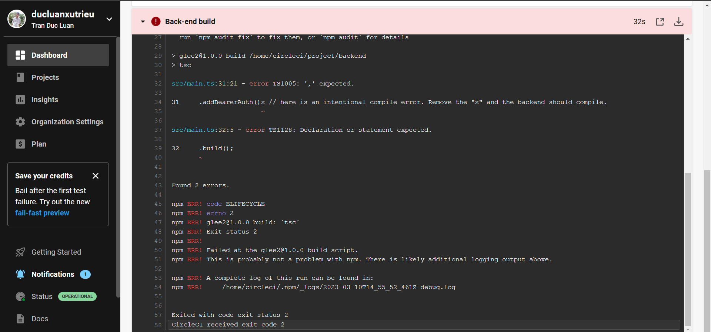
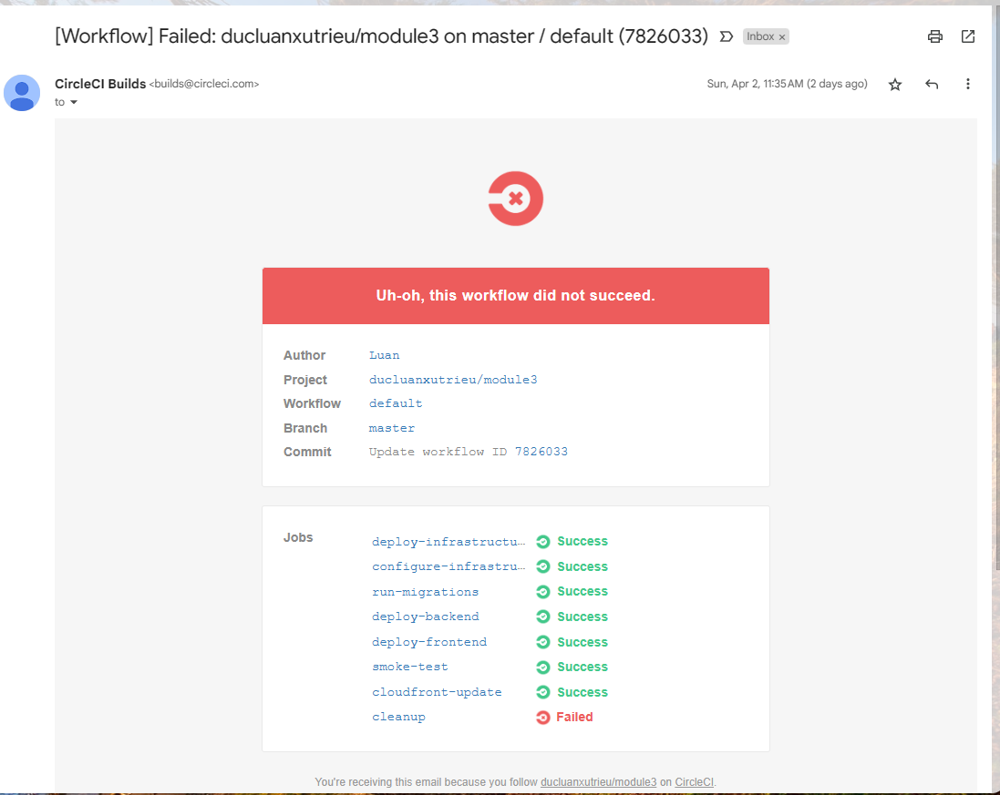
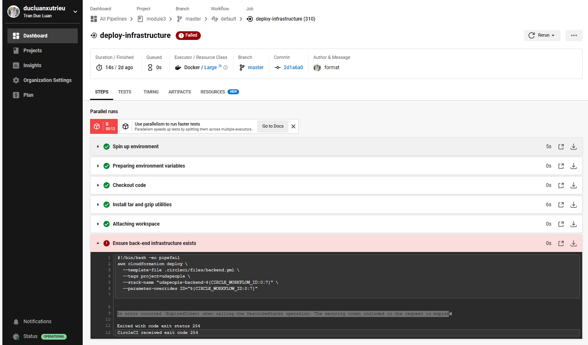

# Section 1: Selling CI/CD to your Team/Organization

CRITERIA
MEETS SPECIFICATIONS
Explain the fundamentals and benefits of CI/CD to achieve, build, and deploy automation for cloud-based software products.

The CI/CD benefits proposal contains essential benefits of CI/CD, and describes the business context that will benefit from the automation tools. Explanation should include benefits that translate to revenue and cost for the business.

# Section 2: Deploying Working, Trustworthy Software

CRITERIA
MEETS SPECIFICATIONS
## Utilize Deployment Strategies to design and build CI/CD pipelines that support Continuous Delivery processes.

A public git repository with your project code. [https://github.com/ducluanxutrieu/cdond-c3-projectstarter]

Evidence of code-based CI/CD configuration in the form of yaml files in your git repository.

Console output of various pre-deploy job failure scenarios:

Build Jobs that failed because of compile errors. 

Failed unit tests. 

Failure because of vulnerable packages.

An alert from one of your failed builds. [SCREENSHOT04]

Evidence in your code that:

Compile errors have been fixed.
Unit tests have been fixed.
All critical security vulnerabilities caught by the “Analyze” job have been fixed.

Utilize a configuration management tool to accomplish deployment to cloud-based servers.

Console output of appropriate failure for infrastructure creation job (using CloudFormation). [SCREENSHOT05]

Console output of a smoke test job that is failing appropriately. [SCREENSHOT06]

Console output of a successful rollback after a failed smoke test. [SCREENSHOT07]

Console output of successful promotion of new version to production in CloudFront. [SCREENSHOT08]

Console output of successful cleanup job that removes old S3 bucket and EC2 instance. [SCREENSHOT09]

Evidence that deploy jobs only happen on master branch. [SCREENSHOT10]

Evidence of deployed and functioning front-end application in an S3 bucket [URL02] and in CloudFront. [URL03]

Evidence of healthy back-end application. [URL04]

Section 3: Turn Errors into Sirens

CRITERIA
MEETS SPECIFICATIONS
Surface critical server errors for diagnosis using centralized logging.

Evidence of Prometheus Server. [URL05]

Evidence that Prometheus is monitoring memory, cpu and disk usage of EC2 instances. [SCREENSHOT11]

Evidence that Prometheus and AlertManager send alerts when certain conditions exist in the EC2 instance. [SCREENSHOT12]